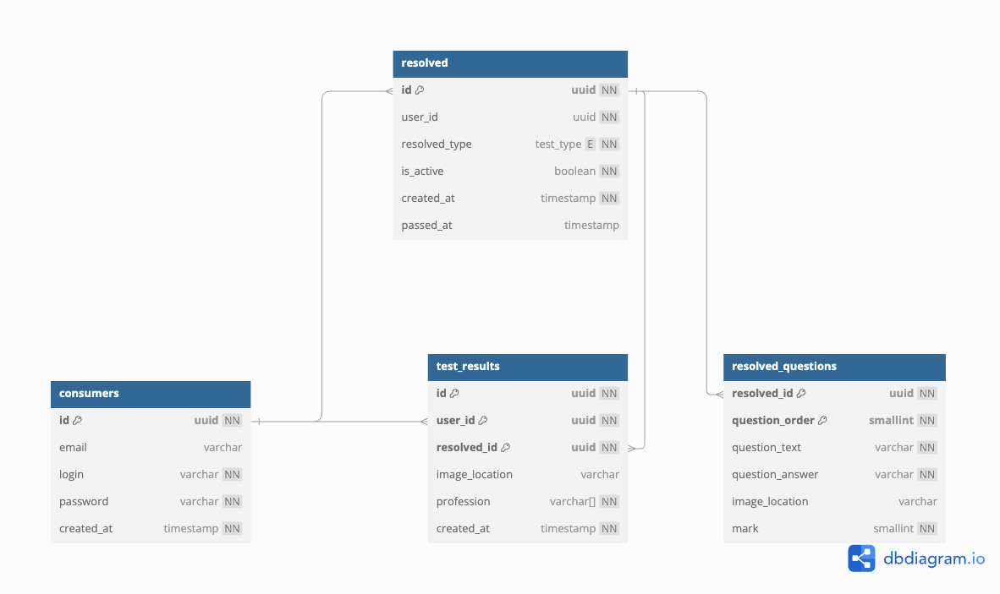
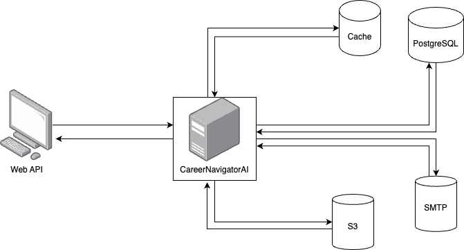

# CareerNavigatorAI

## Немного о проекте.

Наш проект - веб-приложение "CareerNavigatorAI". Его главная функция - определение профессии абитуриента/школьника с помощью тестирования. Для него написан *RestAPI* на языке программирования *Go* с использованием фреймворка *Echo*. В этом приложении пользователи могут регистрироваться, проходить тесты.

## Базовые модели проекта.

Более подробно с базовыми моделями можно ознакомиться в [спецификации API](SPECIFICATION.md).

## Схема базы данных.

Более подробно со схемой базы данных можно ознакомиться в [схеме базы данных](content/Hackaton.png).


## Схема взаимодействия приложения.

Более подробно со схемой взаимодействия приложения можно ознакомиться в [схеме взаимодействия](content/CareerNavigatorAI.png).


## Начало работы.

1. Склонируйте репозиторий в любую подходящую директорию на вашем компьютере.
    ```bash
   git clone https://github.com/Grbisba/hack-backend.git
   cd hack-backend
   ```
2. Создайте директорию env в корне проекта.
    ```bash
   mkdir env
    ```
3. Опишите необходимые переменные окружения в следующих файлах.
    - minio.env - для запуска minio в docker контейнере.
    - postgres.env - для запуска postgres в docker контейнере.
    - server.env - для запуска server в docker контейнере.
4. Для запуска сервера необходим конфигурационный файл `config.json`.
5. Для корректной работы сервиса необходим файл с тестами `test.yaml`.
6. Используйте для запуска docker демона:
   ```bash
   service docker run
   ```
7. Используйте для запуска и сборки docker контейнера:
   ```bash
   sudo docker compose up --build -d
   ```
   или
    ```bash
   docker compose up --build -d
   ```
   или
    ```bash
   make dock/run
   ```

### Makefile инструкции.

- Команда `make help` запускает краткое описание makefile.
- Команда `make build` создает/обновляет бинарный файл для запуска проекта.
- Команда `key-gen` создает директорию и два ключа в ней. Используется для аутентификации в сервисе.
- Команда `lines`    возвращает общее количество строк в коде проекта.
- Команда `dock/run` собирает и запускает docker контейнер.

## Программы, использованные в процессе написания API.

* [Docker](https://www.docker.com/) - программное обеспечение для автоматизации развёртывания и управления приложениями
  в средах с поддержкой контейнеризации, контейнеризатор приложений.
* [PostgreSQL](https://www.postgresql.org/) — свободная объектно-реляционная система управления базами данных (СУБД).
* [Minio](https://min.io/) - лёгкое, высокоэффективное распределённое объектное хранилище с открытым исходным кодом.

## Пакеты, использованные в процессе написания API.

* github.com/aws/aws-sdk-go-v2 [aws-sdk](https://github.com/aws/aws-sdk-go-v2) - Драйвер для работы с S3.
* github.com/golang-jwt/jwt [jwt-go](https://github.com/golang-jwt/jwt) - Реализация jwt-токена.
* github.com/google/uuid [uuid](https://github.com/google/uuid) - Реализация UUID-типа данных.
* github.com/labstack/echo/v4 [Echo](https://github.com/labstack/echo) - Фреймворк для написания API.
* go.uber.org/zap [zap](https://github.com/uber-go/zap) - Реализация готового логирования.
* github.com/jackc/pgx/v5/pgxpool [pgx](https://github.com/jackc/pgx) - Драйвер и набор инструментов для реализации postgresql.
* github.com/heetch/confita [confita](https://github.com/heetch/confita) - Реализация конфигурирования API.

## Лицензия

Данный проект лицензирован под «MIT License». Ознакомится с лицензией можно в файле [LICENSE](LICENSE).

